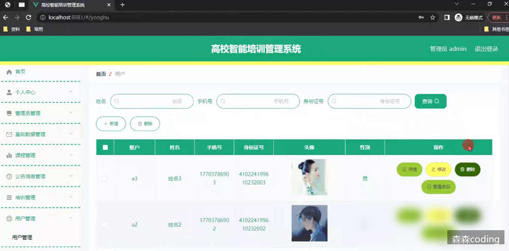

# 基于ssm+vue.js+uniapp小程序的高校智能培训管理系统分析与设计附带文章和源代码设计说明文档ppt

> **发布时间**: 2025-09-26
> **标签**: # Java精品实战案例, # 微信小程序项目精品案例, vue.js, uni-app, 小程序, spring, 学习, 前端

---

## 📞 联系方式
> 💬 **微信：sen232sen** | 🚀 **专业定制各类管理系统** | ⭐ **源码获取/技术支持**

---

##

  * 前言
  * 详细视频演示
  * 具体实现截图
  * 技术栈
  *     * 后端框架SSM
    * 前端框架Vue
    * 持久层框架MyBaits
  * 系统测试
  *     * 系统测试目的
    * 系统功能测试
    * 系统测试结论
  * 为什么选择我
  * 代码参考
  * 数据库参考
  * 源码获取

## 📞 联系方式
> 💬 **微信：sen232sen** | 🚀 **专业定制各类管理系统** | ⭐ **源码获取/技术支持**

---

## 前言

🌞**博主介绍** ：✌CSDN特邀作者、985计算机专业毕业、某互联网大厂高级全栈开发程序员、码云/掘金/华为云/阿里云/InfoQ/StackOverflow/github等平台优质作者、专注于Java、小程序、前端、python等技术领域和毕业项目实战，以及程序定制化开发、全栈讲解、就业辅导、面试辅导、简历修改。✌🌞

> 

## 详细视频演示

请联系我获取更详细的演示视频

## 具体实现截图

  
  
  

## 技术栈

### 后端框架SSM

SSM框架是一种基于Spring、Spring MVC和MyBatis的开发框架，它们分别负责不同的功能模块，共同构建了一个完整的Java Web应用程序。下面是对SSM框架的三个组成部分的简要介绍：

  1. **Spring框架** ：Spring是一个轻量级的Java开发框架，提供了广泛的功能，包括依赖注入、面向切面编程（AOP）、事务管理等。Spring的核心容器管理了应用程序中的对象，使得对象之间的依赖关系更加清晰，并且降低了耦合度。

  2. **Spring MVC框架** ：Spring MVC是Spring框架的一部分，用于构建Web应用程序。它基于MVC（Model-View-Controller）设计模式，将应用程序分为模型（Model）、视图（View）和控制器（Controller）三层。模型负责处理业务逻辑，视图负责展示数据，控制器负责处理用户请求和调度逻辑。

  3. **MyBatis框架** ：MyBatis是一个持久层框架，它简化了与数据库的交互过程。通过配置映射文件，开发人员可以将Java对象映射到数据库表中，并且可以通过SQL语句进行数据库操作。MyBatis提供了一种优雅的方式来管理数据库访问代码，并且能够很好地与Spring集成。

SSM框架的优点包括灵活性高、配置简单、易于学习和使用等。它们的结合使得开发人员可以快速搭建起一个稳定、高效的Java Web应用程序。

下面是核心代码的示例：

    import org.springframework.boot.SpringApplication;
    import org.springframework.boot.autoconfigure.SpringBootApplication;
    import org.springframework.web.bind.annotation.GetMapping;
    import org.springframework.web.bind.annotation.RestController;
    
    @SpringBootApplication
    @RestController
    public class HelloWorldApplication {
    
        public static void main(String[] args) {
            SpringApplication.run(HelloWorldApplication.class, args);
        }
    
        @GetMapping("/hello")
        public String helloWorld() {
            return "Hello, World!";
        }
    }

这段代码定义了一个Spring Boot应用程序的入口类`HelloWorldApplication`，使用`@SpringBootApplication`注解标记为一个Spring Boot应用程序，并使用`@RestController`注解将该类标记为一个RESTful控制器。

在控制器中，我们定义了一个`helloWorld`方法，并使用`@GetMapping`注解将该方法映射到"/hello"路径，当访问该路径时，该方法会返回一个简单的字符串"Hello, World!"作为响应。

通过`SpringApplication.run`方法启动应用程序后，Spring Boot会自动配置并启动内嵌的服务器，我们可以通过访问"http://localhost:8080/hello"来调用`helloWorld`方法，并得到"Hello, World!"作为响应。

这个示例展示了一个最简单的Spring Boot应用程序，你可以根据自己的需求进一步扩展和定制代码。希望这个示例能帮助你更好地理解Spring Boot的核心代码。

### 前端框架Vue

Vue.js是一种流行的JavaScript框架，它具有许多优势。其中，Vue.js的核心优势之一是虚拟DOM技术。虚拟DOM是一个内存中的数据结构，它在实现高效的DOM操作方面发挥了重要作用。

Vue.js采用了响应式数据绑定、虚拟DOM、组件化等现代化技术，为开发者提供了一种灵活、高效、易于维护的开发模式。当数据发生变化时，Vue.js能够自动更新UI，开发者无需手动更新UI，从而能够更加专注于数据处理。

下面是一个示例代码，演示了Vue.js的核心功能：

    <!DOCTYPE html>
    <html>
    <head>
      <title>Vue.js Demo</title>
      
    </head>
    <body>
      

        <h2>{{ message }}</h2>
        <button @click="changeMessage">Change Message</button>
      

    
      
    </body>
    </html>

在这个示例中，我们创建了一个Vue实例，并将其绑定到页面上的一个元素（id为"app"）。通过`data`属性，我们定义了一个名为`message`的变量，并将其初始值设为"Hello, Vue.js!"。在页面上，我们使用双花括号语法(`{{ message }}`)将`message`的值显示出来。通过`methods`属性，我们定义了一个名为`changeMessage`的方法，当点击按钮时，该方法会修改`message`的值。由于Vue.js的响应式数据绑定机制，一旦`message`的值发生变化，页面上显示的内容也会自动更新。

通过这个示例，我们可以看到Vue.js的简洁、灵活和高效的特点。它使得开发者能够更加轻松地处理数据和UI之间的关系，提高开发效率。无论是构建小型应用还是大型复杂的单页应用，Vue.js都是一个值得考虑的选择。

### 持久层框架MyBaits

MyBatis是一个开源的持久层框架，它可以帮助开发者简化数据库操作的编写和管理。MyBatis的核心思想是将SQL语句和Java代码分离，通过XML或注解的方式来描述数据库操作，从而实现了数据访问层的解耦和灵活性。

MyBatis的优势主要包括以下几点：

  1. 简化数据库操作：MyBatis通过提供强大的SQL映射功能，可以将Java对象与数据库表进行映射，开发者无需手动编写繁琐的SQL语句，大大简化了数据库操作的编写和维护。

  2. 灵活的SQL控制：MyBatis支持动态SQL，可以根据不同的条件和逻辑来动态生成SQL语句，使得查询、更新等操作更加灵活和可控。

  3. 缓存支持：MyBatis提供了一级缓存和二级缓存的支持，可以有效减少数据库的访问次数，提高系统性能。

  4. 可扩展性强：MyBatis采用插件机制，可以方便地扩展和定制自己的功能，满足各种不同的业务需求。

## 系统测试

为了确保我们的系统达到最高的质量标准，本系统进行了全方位的测试。我们的目标是从多个角度发现系统中存在的问题，并及时进行改进，以确保系统的完整性和可靠性。

通过功能测试，能够找出系统中的潜在缺陷，并对其进行修复。这样可以确保我们的系统能够无缺陷地运行，满足客户的需求。我们积极寻找问题和不足之处，并及时采取措施进行改进。

在测试过程中，我们不仅仅关注系统的功能性，还注重系统是否满足用户的需求。通过这些测试，我们能够准确地评估系统的性能，并得出测试结论。我们的目标是确保系统的质量和稳定性，为用户提供优质的体验。

我们不断努力，持续优化我们的系统，以满足用户的期望和需求。我们将继续进行测试和改进，以确保我们的系统始终处于最佳状态。

### 系统测试目的

在管理系统的开发周期中，系统测试是至关重要的环节。它是确保系统质量和可靠性的最后一道关卡，也是整个开发过程的最后一次检查。

系统测试的主要目的是避免用户在使用过程中遇到问题，提升用户体验。我们需要从多个角度和思路出发，考虑系统可能遇到的问题，并通过模拟不同的场景来发现缺陷并解决问题。测试过程中，我们也可以评估系统的质量情况，检查系统功能是否完备，逻辑是否顺畅。一次成功的系统测试将极大地提升系统的质量和用户体验。

测试的目标是验证系统是否符合需求规格说明书的定义，并找出与需求规格说明书不符或冲突的内容。在测试过程中，我们始终站在用户的角度考虑问题，避免浪费时间在一些不切实际的场景上，以确保预期结果与实际结果一致。

本系统致力于保障系统的质量和稳定性，优化用户的使用体验。通过系统测试，能够及时发现并解决问题，确保系统符合用户需求，并提供最佳的服务。我们将持续努力，提高系统的可靠性和用户满意度。

### 系统功能测试

系统功能测试是对系统功能模块进行的测试过程。通过点击、输入边界值、验证必填项和非必填项等方法进行黑盒测试。编写测试用例，根据测试用例执行测试，并得出测试结论。

以登录功能为例，本系统进行登录功能测试。当用户需要登录系统时，本系统通过账户密码等功能点进行验证。用户在输入时需要与数据库存储的数据匹配。如果其中某项输入错误，系统将提示输入错误。该界面还对角色权限进行校验，当用户选择管理员角色登录时，系统会报错。下表是登录功能的测试用例示例：

输入数据| 预期结果| 实际结果| 结果分析  
---|---|---|---  
用户名：guanliyuan 密码：123456 验证码：正确输入| 登录系统| 成功登录系统| 结果一致  
用户名：guanliyuan 密码：111111 验证码：正确输入| 密码错误| 密码错误，请重新输入密码| 结果一致  
用户名：guanliyuan 密码：123456 验证码：错误输入| 验证码错误| 验证码信息错误| 结果一致  
用户名：空 密码：123456 验证码：正确输入| 用户名必填| 请输入用户名| 结果一致  
用户名：guanliyuan 密码：空 验证码：正确输入| 密码错误| 密码错误，请重新输入密码| 结果一致  
  
另外，本系统还进行了用户管理功能的测试。用户管理包括添加、编辑、删除和查找用户等功能。本系统测试了以下各项功能的测试用例：

  1. 添加用户功能测试用例：

输入数据| 预期结果| 实际结果| 结果分析  
---|---|---|---  
用户名：user1 密码：123456 角色：普通用户| 添加成功，并在用户列表中显示| 用户列表中出现用户1| 结果一致  
用户名：user2 密码：111111 角色：普通用户| 添加成功，并在用户列表中显示| 用户列表中出现用户2| 结果一致  
用户名：user1 密码：123456 角色：普通用户| 添加失败，提示用户名已存在| 添加失败，提示用户名已存在| 结果一致  
用户名：空 密码：123456 角色：普通用户| 添加失败，提示用户名不能为空| 添加失败，提示用户名不能为空| 结果一致  
  
  2. 编辑用户功能测试用例：

输入数据| 预期结果| 实际结果| 结果分析  
---|---|---|---  
选择用户1，修改密码为654321| 编辑成功，密码修改成功| 用户1密码已修改为654321| 结果一致  
选择用户2，修改角色为管理员| 编辑成功，角色修改成功| 用户2角色已修改为管理员| 结果一致  
选择用户1，清空用户名| 编辑失败，提示用户名不能为空| 编辑失败，提示用户名不能为空| 结果一致  
  
  3. 删除用户功能测试用例：

输入数据| 预期结果| 实际结果| 结果分析  
---|---|---|---  
选择用户1进行删除操作| 系统询问是否删除用户，确认后用户被删除| 用户1已成功删除| 结果一致  
选择用户2进行删除操作| 系统询问是否删除用户，取消删除操作| 用户2未被删除| 结果一致  
  
通过系统功能测试，确保系统的功能完备性，系统能够按照需求规格说明书的定义正常运行。我们将继续进行测试工作，发现并修复潜在问题，为用户提供功能完善的系统体验。

### 系统测试结论

本系统主要使用黑盒测试，通过模拟用户使用系统实现各个功能编写测试用例，并进行测试。以确保系统流程的正确性。系统测试必不可少，可以使系统更加完善，该系统的可使用性也会更高。  
测试该系统主要为了验证系统的功能模块是否满足我们最初的设计理念，验证各个功能模块逻辑是否正确，此系统不需要过于复杂的逻辑处理，以便于使用者操作。测试的最终目的也是围绕着用户使用展开。测试过程中所有场景都应符合用户需求，不可偏离需求目标，遇到问题时要站在用户的角度进行思考。经过一系列的测试过程后得到最终的测试结果，从测试结果可以看出，实现的系统在功能和性能方面满足设计要求。

## 为什么选择我

  
博主提供的项目均为博主自己收集和开发的！所有的源码都经由博主检验过，能过正常启动并且功能都没有问题！同学们拿到后就能使用！  
多个成功系统案例：  
  
  
  

## 代码参考

    // 忽略权限验证的注解
    @IgnoreAuth
    @PostMapping(value = "/login")
    public R login(String username, String password, String captcha, HttpServletRequest request) {
       // 查询用户信息
       UsersEntity user = userService.selectOne(new EntityWrapper<UsersEntity>().eq("username", username));
       // 判断用户是否存在或密码是否正确
       if(user==null || !user.getPassword().equals(password)) {
          return R.error("账号或密码不正确");
       }
       // 生成token
       String token = tokenService.generateToken(user.getId(),username, "users", user.getRole());
       return R.ok().put("token", token);
    }
    
    // 生成token
    @Override
    public String generateToken(Long userid,String username, String tableName, String role) {
       // 查询是否存在已有token
       TokenEntity tokenEntity = this.selectOne(new EntityWrapper<TokenEntity>().eq("userid", userid).eq("role", role));
       // 生成随机token字符串
       String token = CommonUtil.getRandomString(32);
       // 设置token过期时间为1小时后
       Calendar cal = Calendar.getInstance();   
       cal.setTime(new Date());   
       cal.add(Calendar.HOUR_OF_DAY, 1);
       if(tokenEntity!=null) {
          // 更新token信息
          tokenEntity.setToken(token);
          tokenEntity.setExpiratedtime(cal.getTime());
          this.updateById(tokenEntity);
       } else {
          // 新建token记录
          this.insert(new TokenEntity(userid,username, tableName, role, token, cal.getTime()));
       }
       return token;
    }
    
    /**
     * 权限(Token)验证拦截器
     */
    @Component
    public class AuthorizationInterceptor implements HandlerInterceptor {
    
        // 定义Token在请求Header中的键名
        public static final String LOGIN_TOKEN_KEY = "Token";
    
        @Autowired
        private TokenService tokenService;
        
        @Override
        public boolean preHandle(HttpServletRequest request, HttpServletResponse response, Object handler) throws Exception {
            // 支持跨域请求
            response.setHeader("Access-Control-Allow-Methods", "POST, GET, OPTIONS, DELETE");
            response.setHeader("Access-Control-Max-Age", "3600");
            response.setHeader("Access-Control-Allow-Credentials", "true");
            response.setHeader("Access-Control-Allow-Headers", "x-requested-with,request-source,Token, Origin,imgType, Content-Type, cache-control,postman-token,Cookie, Accept,authorization");
            response.setHeader("Access-Control-Allow-Origin", request.getHeader("Origin"));
    
            // 跨域时会首先发送一个OPTIONS请求，这里我们给OPTIONS请求直接返回正常状态
            if (request.getMethod().equals(RequestMethod.OPTIONS.name())) {
                response.setStatus(HttpStatus.OK.value());
                return false;
            }
            
            // 获取HandlerMethod注解
            IgnoreAuth annotation;
            if (handler instanceof HandlerMethod) {
                annotation = ((HandlerMethod) handler).getMethodAnnotation(IgnoreAuth.class);
            } else {
                return true;
            }
    
            // 从header中获取token
            String token = request.getHeader(LOGIN_TOKEN_KEY);
            
            /**
             * 不需要验证权限的方法直接放过
             */
            if(annotation!=null) {
                return true;
            }
            
            // 根据token获取token实体
            TokenEntity tokenEntity = null;
            if(StringUtils.isNotBlank(token)) {
                tokenEntity = tokenService.getTokenEntity(token);
            }
            
            if(tokenEntity != null) {
                // 将用户信息存入session
                request.getSession().setAttribute("userId", tokenEntity.getUserid());
                request.getSession().setAttribute("role", tokenEntity.getRole());
                request.getSession().setAttribute("tableName", tokenEntity.getTablename());
                request.getSession().setAttribute("username", tokenEntity.getUsername());
                return true;
            }
            
            // 验证失败，返回401错误和提示信息
            PrintWriter writer = null;
            response.setCharacterEncoding("UTF-8");
            response.setContentType("application/json; charset=utf-8");
            try {
                writer = response.getWriter();
                writer.print(JSONObject.toJSONString(R.error(401, "请先登录")));
            } finally {
                if(writer != null){
                    writer.close();
                }
            }
            return false;
        }
    }

这段Java代码主要是一个登录功能的实现，涉及到生成Token和权限验证的拦截器。

  1. `@IgnoreAuth` 注解：这是一个自定义的注解，用于标识不需要进行权限验证的方法。

  2. `@PostMapping(value = "/login")`：这是一个使用POST请求方式的登录接口。

  3. `login` 方法：该方法接收用户名、密码和验证码作为参数，并返回一个包含生成的Token的响应对象。首先通过用户名查询用户信息，然后判断用户是否存在并验证密码是否正确。如果验证失败，则返回错误提示；如果验证成功，则调用 `generateToken` 方法生成Token，并将其添加到响应对象中返回。

  4. `generateToken` 方法：该方法用于生成Token。首先查询是否存在已有的Token实体，然后生成一个随机的Token字符串。接下来，设置Token的过期时间为当前时间加上1小时，并根据情况进行更新或插入Token记录。最后返回生成的Token字符串。

  5. `AuthorizationInterceptor` 类：这是一个权限验证拦截器实现类。它实现了 `HandlerInterceptor` 接口，用于在请求处理之前进行权限验证。在 `preHandle` 方法中，首先设置支持跨域请求的相关头信息，并处理跨域时的 OPTIONS 请求。然后，通过反射获取请求处理方法上的 `@IgnoreAuth` 注解，如果存在该注解，则直接放过。接着，从请求头中获取 Token，并根据 Token 获取对应的 Token 实体。如果 Token 实体存在，则将用户信息存入 session，并放行请求。如果验证失败，则返回401错误和相应的提示信息。

总结，这段代码实现了一个基本的登录功能，并加入了对权限的验证拦截，确保只有拥有有效 Token 的用户才能访问受限资源。

## 数据库参考

根据给出的数据库SQL语句，设计一个商品表的示例：

    -- ----------------------------
    -- Table structure for product
    -- ----------------------------
    DROP TABLE IF EXISTS `product`;
    CREATE TABLE `product` (
      `id` bigint(20) NOT NULL AUTO_INCREMENT COMMENT '主键',
      `name` varchar(100) NOT NULL COMMENT '商品名称',
      `price` decimal(10, 2) NOT NULL COMMENT '商品价格',
      `description` varchar(200) DEFAULT NULL COMMENT '商品描述',
      `stock` int(11) NOT NULL COMMENT '商品库存',
      `create_time` timestamp NOT NULL DEFAULT CURRENT_TIMESTAMP COMMENT '创建时间',
      `update_time` timestamp NOT NULL DEFAULT CURRENT_TIMESTAMP ON UPDATE CURRENT_TIMESTAMP COMMENT '更新时间',
      PRIMARY KEY (`id`) USING BTREE
    ) ENGINE=InnoDB AUTO_INCREMENT=1 DEFAULT CHARSET=utf8 ROW_FORMAT=COMPACT COMMENT='商品表';

该商品表包括以下字段：

  * `id`：商品的主键，自增长。
  * `name`：商品的名称，不能为空。
  * `price`：商品的价格，采用10位整数和2位小数的形式存储。
  * `description`：商品的描述，最多200个字符。
  * `stock`：商品的库存数量。
  * `create_time`：商品的创建时间，记录商品被添加的时间。
  * `update_time`：商品的更新时间，记录商品信息最近一次被修改的时间。

– 向商品表插入数据示例

    INSERT INTO `product` (`name`, `price`, `description`, `stock`)
    VALUES ('iPhone 13', 999.99, 'A powerful and advanced smartphone', 100);
    
    INSERT INTO `product` (`name`, `price`, `description`, `stock`)
    VALUES ('Samsung Galaxy S21', 899.99, 'A flagship Android smartphone', 150);
    
    INSERT INTO `product` (`name`, `price`, `description`, `stock`)
    VALUES ('Sony PlayStation 5', 499.99, 'Next-gen gaming console', 50);

## 源码获取
> 💬 **微信：sen232sen**
> 
> 🚫 **白嫖勿扰** 😊

私信联系我即可~  
大家点赞、收藏、关注、评论啦 、查看👇🏻获取联系方式👇🏻  
精彩专栏推荐订阅：在下方专栏👇🏻

> [Java精品实战案例《500套》](https://blog.csdn.net/2401_82799502/category_12569317.html)
> 
> [微信小程序项目精品案例《500套》](https://blog.csdn.net/2401_82799502/category_12569320.html)  
>  [Java核心技术精选](https://blog.csdn.net/2401_82799502/category_12566134.html)  
>  [Java框架精选](https://blog.csdn.net/2401_82799502/category_12569303.html)

---

